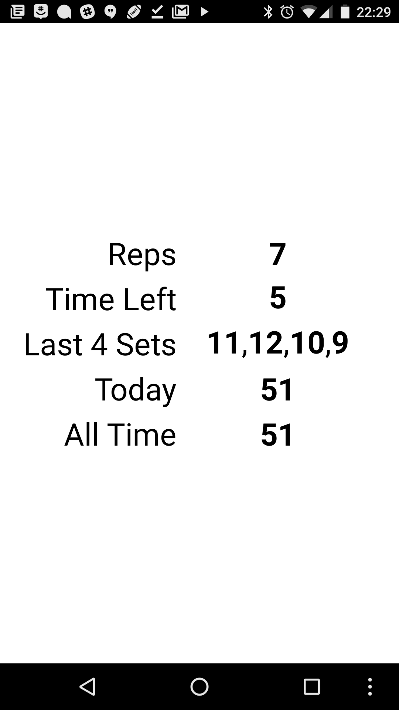

# push-up-progress
Simple android app built with [MIT App Inventor 2](http://appinventor.mit.edu/) that uses the phone's proximity sensor to implement hands free tracking of push up sets.

Check it out in the [Google Play Store](https://play.google.com/store/apps/details?id=appinventor.ai_JustinWhite321.pushupcounter)!
